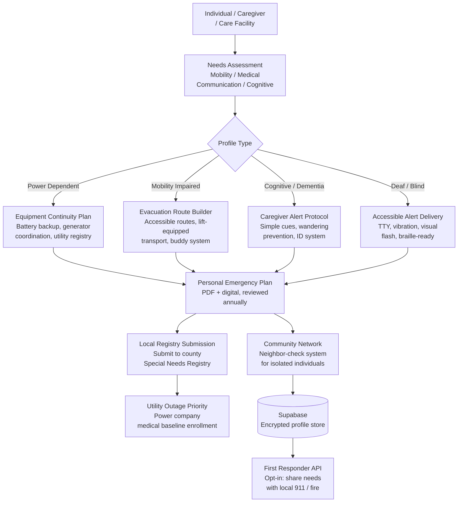

<p align="center">
  <h1 align="center">foundation-ready-all</h1>
  <h3 align="center"><em>Disaster preparedness for disabled & elderly. 2-4x mortality rate.</em></h3>
</p>

<p align="center">
  <a href="LICENSE"></a>
  
  
  <a href="https://mama.oliwoods.ai"></a>
  <a href="https://mama.oliwoods.ai/foundation"></a>
</p>

---

> *"In Hurricane Katrina, people with disabilities died at more than twice the rate of the general population. In Hurricane Maria, disabled and elderly residents in rural Puerto Rico waited weeks for evacuation that never came. This is not a natural disaster problem. It is a systems design problem."*
> — National Council on Disability, Preserving Our Freedom, 2019

## Why This Exists

Standard emergency management systems are designed for ambulatory adults who can drive, self-evacuate, and power their own devices. For the 61 million Americans with disabilities and 55 million Americans over 65, these plans are effectively written in a language they cannot use.

- **People with disabilities die at 2-4x the rate** of the general population in disasters (National Council on Disability, 2019)
- **61 million adults** in the U.S. have a disability — 1 in 4 Americans (CDC, 2023)
- **Power-dependent individuals** (ventilators, oxygen concentrators, powered wheelchairs) face life-threatening risk within hours of an outage, yet fewer than 15% have a formal power backup plan (AARP, 2022)
- **Less than 30% of local emergency plans** include specific protocols for people with access and functional needs (FEMA, 2021)

Ready-All builds the plan that the system forgot to write.

## System Architecture



## Features

| Feature | Description | Standard |
|---------|-------------|----------|
| **Needs-Based Profile** | Mobility, medical equipment, communication, and cognitive needs mapped to specific plans | ADA + AFN framework |
| **Power-Dependent Equipment Plan** | Generator sizing, battery backup duration, utility medical baseline enrollment, outage protocol | CMS durable medical |
| **Accessible Evacuation Routes** | Wheelchair-accessible route mapping, lift-equipped transport coordination, buddy system | ADA evacuation code |
| **Special Needs Registry Auto-Submit** | One-click submission to county emergency management special needs registries | FEMA AFN framework |
| **Multi-Modal Alert Delivery** | SMS, TTY, vibration alerts, visual flash, audio — matched to individual communication needs | WCAG 2.1 AA |
| **Caregiver Command Center** | Real-time status for home care workers, family caregivers, and care facilities | HIPAA-compatible |
| **First Responder Data Share** | Opt-in: pre-share needs profile with local 911, fire, and EMS for faster response | NCI 911 protocol |
| **Annual Plan Review** | Automated annual reminder to update equipment, medications, and contacts | FEMA Ready.gov |

## Research Foundation

| Citation | Finding | Relevance |
|----------|---------|-----------|
| NCD (2019) | Disabled individuals die 2-4x more in disasters; systemic exclusion from planning | Core mission |
| CDC (2023) | 1 in 4 U.S. adults has a disability; mobility, cognition, hearing most prevalent | Population sizing |
| AARP (2022) | < 15% of power-dependent individuals have formal backup power plans | Equipment continuity feature |
| FEMA (2021) | < 30% of local emergency plans include Access and Functional Needs protocols | Gap this fills |

## Quick Start

```bash
git clone https://github.com/OliWoods-Org/foundation-ready-all.git
cd foundation-ready-all
npm install
npm run dev
```

## Tech Stack

- **Runtime:** Node.js + TypeScript
- **Validation:** Zod schemas
- **Database:** Supabase (PostgreSQL)
- **AI:** Claude API / local LLM (offline mode)
- **Alerts:** Twilio (SMS/WhatsApp/TTY), Resend (email)
- **Mapping:** Accessible route data via OpenStreetMap + wheelchair accessibility overlays

## Contributing

We seek contributions from disabled individuals, occupational therapists, emergency management professionals, elder care specialists, and accessibility engineers. If you have direct experience with disability and disaster, your perspective is foundational here.

1. Fork the repo
2. Create a feature branch (`git checkout -b feat/amazing-feature`)
3. Commit your changes
4. Push and open a PR

## License

AGPL-3.0 — Free to use, modify, and distribute.

---

<p align="center">
  <strong>Built by the <a href="https://oliwoods.ai">OliWoods Foundation</a></strong><br>
  <em>Free forever. Open source. Because "ready" has to mean everyone.</em>
</p>
